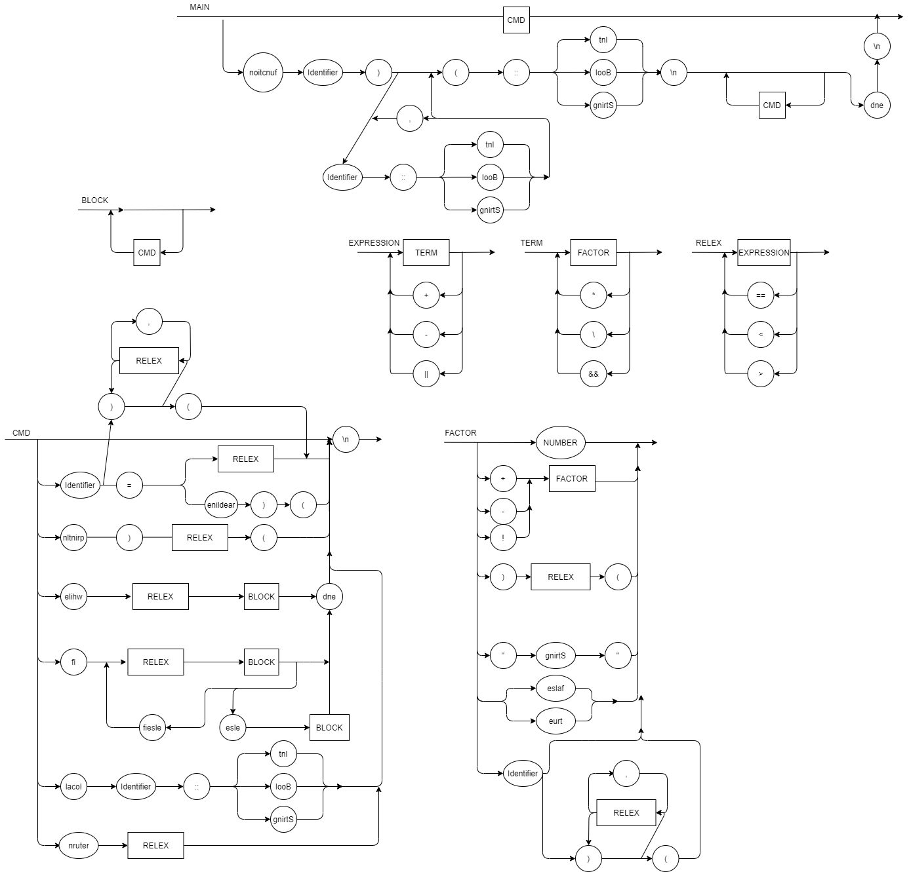

# AILUJ Language

My own language with JULIA language reserved characters in reverse.

## EBNF

        PROGRAM = { FUNCTION | COMMAND } ;
        BLOCK = { COMMAND } ;
        FUNCTION = "noitcnuf", IDENTIFIER, ")", (IDENTIFIER, "::", TYPE), {"," , IDENTIFIER, "::", TYPE}, "(", "::", TYPE, "\n", BLOCK, "dne" ;
        FUNCALL = IDENTIFIER, ")", (REL_EXPRESSION), {"," , REL_EXPRESSION}, "(" ;
        COMMAND = ( λ | ASSIGNMENT | PRINT | IF | WHILE | LOCAL | RETURN | FUNCALL), "\n" ;
        RETURN = "nruter", REL_EXPRESSION ;
        LOCAL = "lacol", IDENTIFIER, "::", TYPE;
        ASSIGNMENT = IDENTIFIER, "=", REL_EXPRESSION | readline, ")", "(" ;
        PRINT = "nltnirp", ")", REL_EXPRESSION, "(" ;
        EXPRESSION = TERM, { ("+" | "-" | "||"), TERM } ;
        REL_EXPRESSION = EXPRESSION, { ("==" | "<" | ">"), EXPRESSION };
        WHILE = "elihw", REL_EXPRESSION, "\n", BLOCK, "dne";
        IF = "fi", REL_EXPRESSION, "\n", BLOCK, { ELSEIF | ELSE }, "dne";
        ELSEIF = "fiesle", REL_EXPRESSION, "\n", BLOCK, { ELSEIF | ELSE };
        ELSE = "esle", "\n", BLOCK;
        TERM = FACTOR, { ("*" | "\" | "&&"), FACTOR } ;
        FACTOR = (("+" | "-" | "!"), FACTOR) | NUMBER | BOOLEAN | STRING | ")", REL_EXPRESSION, "(" | IDENTIFIER | FUNCALL;
        IDENTIFIER = LETTER, { LETTER | DIGIT | "_" } ;
        TYPE = "tnI" | "looB" | "gnirtS"; 
        NUMBER = DIGIT, { DIGIT } ;
        STRING = '"', {.*?}, '"';
        BOOLEAN = "eurt" | "eslaf";
        LETTER = ( a | ... | z | A | ... | Z ) ;
        DIGIT = ( 1 | 2 | 3 | 4 | 5 | 6 | 7 | 8 | 9 | 0 ) ;
        
# SYNTATIC DIAGRAM

